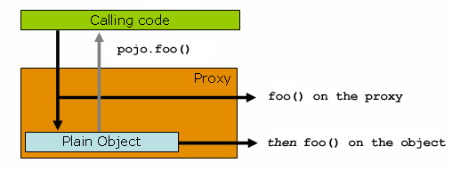
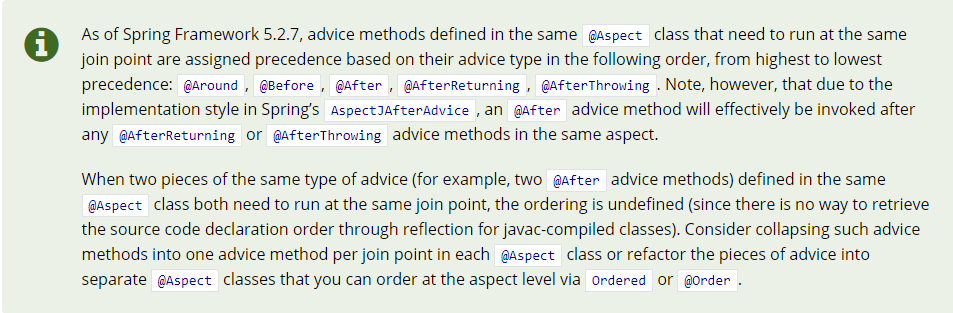

# AOP Usage Share

[TOC]

## AOP

### 概念

> "为所有API记录每次请求的信息（API逻辑执行前）"

 

> 横切需求："在不侵入业务代码的情况下，为所有API记录每次请求的信息（API逻辑执行前）"

* **AOP**：实现 "在不侵入业务代码的情况下，为所有API记录每次请求的信息（API逻辑执行前）"的过程
* **Aspect**：“在不侵入业务代码的情况下，为所有API记录每次请求的信息（API逻辑执行前）”的实现，或者说Advice + Pointcut
* Join point：每一个API
* **Pointcut**：所有API（所有Join point的集合）
* **Advice**：“记录每次请求的信息”、“API逻辑执行前”
* **Weaving**：把Advice应用到Join point的过程

定义Aspect、Pointcut、Advice等概念是为了沟通、编程而进行的抽象。

### AOP过程

- 需求（Join point，切入时机，附加逻辑）
- 定义Aspect：Pointcut，Advice
- Weaving --> Spring AOP，AspectJ...

### Spring AOP与AspectJ

- AOP的两种完全不同的实现，两者大致的原理：
    - Spring AOP:

      使用动态代理进行运行期织入。为被切类生成代理类，当被切对象被其它类依赖时，改为注入代理类。（IOC容器）

       

    - AspectJ:
    
      通过修改代码进行静态织入（在编译器/编译后/加载期），在被切类的逻辑基础上附加Advice的逻辑。
- Spring AOP借用了AspectJ定义的一套注解

## Spring AOP

### 1. 定义Pointcut（Demo01）

@Pointcut Expressions

- execution
- @annotation
- args
- @args
- within
- @within
- target
- @target
- this

Combining Pointcut Expressions：&&    ||

### 2. 定义Advice（Demo01）

- @Before, @After,@Around...

- 被切方法信息获取

### 3. Aspect的执行顺序 （Demo02）

​	各切面的Join Point相同时，会涉及到各切面的执行顺序/优先级问题

- Order不同时：Order 值越小，优先级越高，那么切面越先执行（越后结束）

- Order相同，Advice相同时：按方法名排序

- Order相同，不同Advice时（5.2.7.RELEASE开始）：

  > class that need to run at the same join point are assigned precedence based on their advice type in the following order:
  > // from highest to lowest precedence: **@Around, @Before, @After, @AfterReturning, @AfterThrowing**.

  也就是说执行顺序如下：
  ```
  @Around-before, @Before, Join Point, @AfterReturning/@AfterThrowing, @After, @Around-after/@Around-catch, @Around-Finally
  ```
  
   

### 4. Tips

-  异常
    -  切面附加逻辑会影响被切方法
    -  谨慎处理被切方法抛出的异常（可能会影响到事务）
    
- 5.2.7版本前的Bug：@After在@AfterReturning，@AfterThrowing之前执行

    此BUG在[5.2.7.RELEASE修复](https://github.com/spring-projects/spring-framework/commit/0998bd49ef1c2d45a1f52202854098577d8f7a66)，修复后引起了令一变化：@Before，@AfterReturning的切面代码本身抛错，不会被@AfterThrowing捕获，@After也不执行

- 注意代理方式实现的AOP --> this.xxMethod()的调用方式无法触发xxMethod()的切面逻辑 --> AopContext.currentProxy() **（Demo03）**

     


## AspectJ

### 1.使用环境

依赖、AJC，参考sales-order项目

### 2.Pointcut（Demo01）

| Kind                  | Subject                                                      |
| --------------------- | ------------------------------------------------------------ |
| Method call           | The method picked out by Java as the static target of the method call. |
| Method execution      | The method that is executing.                                |
| Constructor call      | The constructor being called.                                |
| Constructor execution | The constructor executing.                                   |
| Field get             | The field being accessed.                                    |
| Field set             | The field being set.                                         |
| Pre-initialization    | The first constructor executing in this constructor chain.   |
| Initialization        | The first constructor executing in this constructor chain.   |
| Static initialization | The type being initialized.                                  |
| Handler               | The declared type of the exception being handled.            |
| Advice execution      | The advice being executed.                                   |

call与execution区别：静态织入的位置不同

### 3.Tips

如下定义的切点，会在call和execution位置都进行织入，导致重复执行

```java
@Pointcut(value = "@annotation(recordExecuteTime)")
private void recordExecuteTimePointCut(RecordExecuteTime recordExecuteTime) {}
```

## Spring AOP与AspectJ优缺点

Spring-AOP Pros

- It is simpler to use than AspectJ, since you don't have to use LTW ([load-time weaving](http://www.eclipse.org/aspectj/doc/next/devguide/ltw.html)) or the AspectJ compiler.
- It uses the Proxy pattern and the Decorator pattern

Spring-AOP Cons

- limits
    - This is proxy-based AOP, so basically you can only use method-execution joinpoints.
    - Spring-AOP cannot add an aspect to anything that is not created by the Spring factory
    - Aspects aren't applied when calling another method within the same class.

- There can be a little runtime overhead.

AspectJ Pros

- This supports all joinpoints. This means you can do anything.（比如支持切点为类的成员变量）
- There is less runtime overhead than that of Spring AOP.

AspectJ Cons

- Be careful. Check if your aspects are weaved to only what you wanted to be weaved.
- You need extra build process with AspectJ Compiler or have to setup LTW (load-time weaving)
##  AOP应用场景

- 数据记录
    - 执行日期、参数、耗时
- 执行限制
    - 权限校验
    - Schedule
    - 重复提交请求